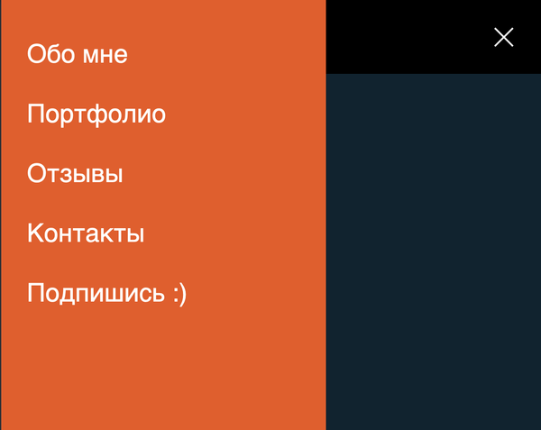

# Burger menu

Меню бургер на чистом js и html  
оставил себе для шпаргалки и понимания.  
Потому, что постоянно забываю.

Взято из [видоса](https://www.youtube.com/watch?v=7teaFMUczXk)  
за что пользователю отдедльное спасибо.

Посмотреть бургер в живую можно [тут](https://stavis-dev.github.io/burger/)
